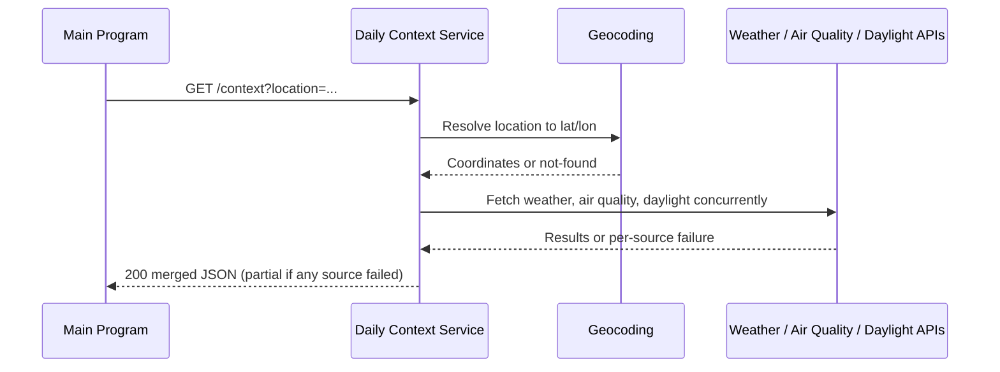

# CS361-Daily_Context_Service
Daily Context Microservice providing Weather, air-quality, and daylight data into a single snapshot for a given location.

## Communication contract
The service uses a REST API with JSON at `http://127.0.0.1:5106` by default.

| Method and path | Purpose |
| --- | --- |
| `GET /health` | Check whether the service is running |
| `GET /context?location={city|zip|lat,long}` | Return merged weather, air quality, and daylight data for a location |

Location can be sent as a city name, a zip code, or a `lat,long` pair. The service resolves the input to coordinates before calling 
the underlying sources. An unrecognized or invalid location returns a JSON `error` object instead of a snapshot.

If one or more of weather, air quality, or daylight fails to return data, the service still responds with whatever succeeded. The
response includes a `partial` flag so callers can tell a full snapshot from a degraded one.

### How to request data
 
```powershell
python -m pip install -r requirements.txt
python app.py
```
 
In another terminal:
 
```powershell
Invoke-RestMethod -Method Get -Uri "http://127.0.0.1:5106/context?location=Corvallis,OR"
```
 
### How to receive data
 
A successful request returns HTTP 200 with merged data:
 
```json
{
  "location": {
    "input": "Corvallis,OR",
    "lat": 44.5646,
    "lon": -123.2620
  },
  "weather": {
    "temp_f": 72,
    "condition": "Partly cloudy"
  },
  "air_quality": {
    "aqi": 32,
    "category": "Good"
  },
  "daylight": {
    "sunrise": "2026-08-09T06:12:00Z",
    "sunset": "2026-08-09T20:41:00Z"
  },
  "partial": false
}
```
 
If a source fails, that section is replaced with an `error` object and
`partial` is set to `true`. Invalid locations return a JSON `error` object
instead of a snapshot.
 
## Request sequence
 

 
## Sprint stories
 
### Today's Context Snapshot

As a user I want to see a snapshot of today’s weather, air quality, and daylight hours so I can decide how to plan my day and habits. 

### Acceptance criteria

#### Functional requirements
Given a request for today’s context, when the endpoint is called, then the service returns weather, air quality, and sunrise/sunset data merged into a single response.
Given one or more underlying sources fails when the request is made, then the service still returns whatever data is available. 

#### Quality attributes & Non-functional requirements
Performance: Response is returned within ~1s
Reliability: Partial results are returned if a source fails.

<br>

### Location Specific Context

As a user I want the daily context to show data specific to my location so that it is relevant to me.

### Acceptance criteria

#### Functional requirements
Given a valid location when the user requests context, then the service returns data specific to that location.
Given an invalid or unrecognized location the service returns a clear error.

#### Quality attributes & Non-functional requirements
Usability: location should accept common formats (city name, zip, lat/long)

## Remaining shared work
Weather source (sources/weather.py) is not yet implemented — owner: Samantha.
Daylight source (sources/daylight.py) is not yet implemented — owner: Samantha.
Air quality (sources/air_quality.py) is not yet implemented — owner: Kelli.
Core geocoding/context endpoint completed and tested - owner: Craig.
